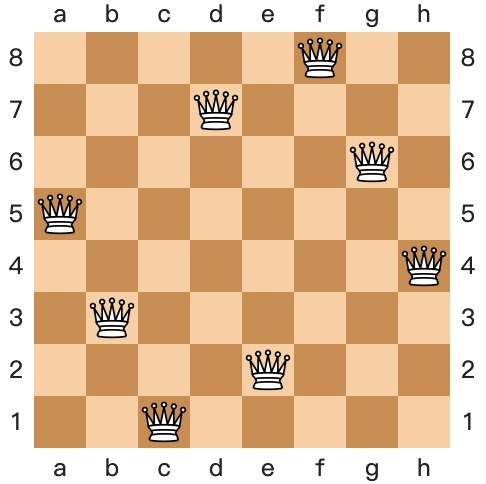

 # THE ANGRY QUEENS
 In this playground, you will learn about a famous algorithm problem💯 **Eight Queens Puzzle♕** through this little game🎮.
 
 By playing this little game👾, you can 📚learn about the details of this puzzle and the algorithms in the eaziest way.
 
 ## What is eight queens puzzle♕?
 The eight queens puzzle♕ is the problem of placing 8 chess queens♕ on an 8×8 chessboardc so that no two queens threaten each other.
 In other words, All the queens are angry😡 at each other. So the solution💡 requires no two queens share the same row, column, or diagonal. Otherwise, they'll start to fight.
 
  

 There are also 3 queens puzzle, 4 queens puzzle, etc.
 
 ## How do you play ?
 **For the first level, try to place all the queens♕ without causing a fight🏹.**
